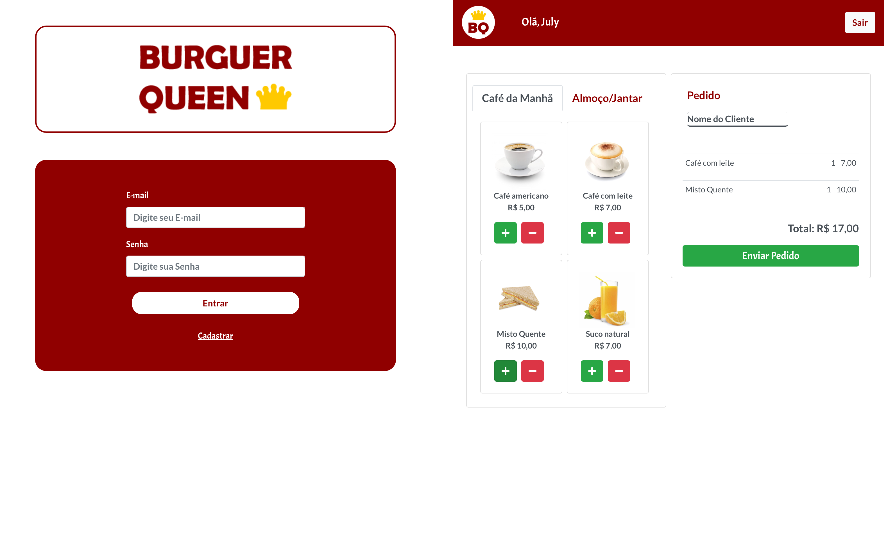
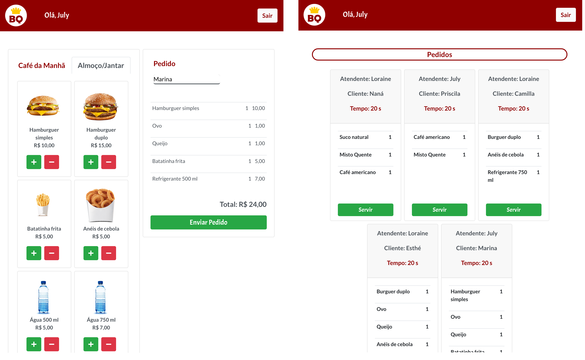

# Burger Queen

## Resumo do projeto

Um pequeno restaurante de hambúrgueres, que está crescendo, necessita uma
interface em que se possa realizar pedidos utilizando um _tablet_, e enviá-los
para a cozinha para que sejam preparados de forma ordenada e eficiente.

Informações do cliente:

> Somos **Burger Queen**, um fast food 24hrs.
>
>A nossa proposta de serviço 24 horas foi muito bem recebida e, para continuar a
>crescer, precisamos de um sistema que nos ajude a receber pedidos de nossos
>clientes.
>
>Nós temos 2 menus. Um muito simples para o café da manhã:
>
>| Ítem                      |Preço R$|
>|---------------------------|------|
>| Café americano            |    5 |
>| Café com leite            |    7 |
>| Sanduíche de presunto e queijo|   10 |
>| Suco de fruta natural     |    7 |
>
>E outro menu para o resto do dia:
>
>| Ítem                      |Preço |
>|---------------------------|------|
>|**Hambúrgueres**           |   **R$**   |
>|Hambúrguer simples         |    10|
>|Hambúrguer duplo           |    15|
>|Queijo                     |     1|
>|Ovo                        |     1|
>|**Acompanhamentos**        |   **R$**   |
>|Batata frita               |     5|
>|Anéis de cebola            |     5|
>|**Bebidas**                |   **R$**   |
>|Água 500ml                 |     5|
>|Água 750ml                 |     7|
>|Bebida gaseificada 500ml   |     7|
>|Bebida gaseificada 750ml   |    10|

A interface deve mostrar os dois menus (café da manhã e restante do dia), cada
um com todos os seus _produtos_. O usuário deve poder escolher que _produtos_
adicionar e a interface deve mostrar o _resumo do pedido_ com o custo total.

## Objetivos de aprendizagem

O objetivo principal é aprender a construir uma interface web usando React. Esse framework front-end ataca o seguinte problema: **como manter a interface e estado sincronizados**. Portanto, esta experiência espera familiarizá-la com o conceito de estado da tela, e como cada mudança no estado vai refletir na interface (por exemplo, toda vez que adicionamos um _produto_ para um _pedido_, a interface deve atualizar a lista de pedidos e o total). A interface deve ser projetada especificamente para rodar em **tablets**.
 

## Checklist

#### HU 1: Perfil de usuário

* [ ] Criar login e senha.
* [ ] Criar tipo de usuário (cozinha / salão).
* [ ] Entrar na tela correta para cada usuário.

#### HU 2: Anotar pedidos

* [ ] Digite o nome do cliente.
* [ ] Filtre _menu_ para _café da manhã_ e _almoço/jantar_.
* [ ] Adicionar item ao pedido.
* [ ] Excluir item do pedido.
* [ ] Mostra _resumo_ do pedido com todos os itens e o total.
* [ ] Enviar para a cozinha (isso deve salvar o pedido).

#### HU 3: Ver pedidos na cozinha

* [ ] Visualização de pedidos pendentes para produção.
* [ ] Marcar pedido como como pronto para entrega.
* [ ] Ver histórico dos pedidos.

## Resultado Final

**Para acessar o produto, use o link: https://burguer-queen-la.firebaseapp.com**

 Para fazer login, você pode usar os seguintes dados:

 **Usuário: salao@email.com** (Para acessar o salão)

 **Usuário: cozinha@email.com** (Para acessar a cozinha)

 **Senha: 123456** (Para ambos acessos)

